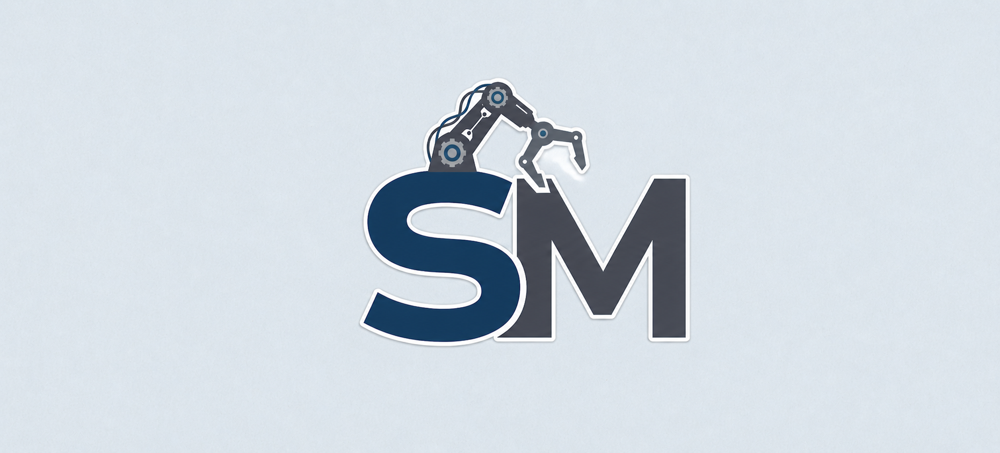

# sync
Plataforma desenvolvida para conectar indústrias a profissionais especializados em manutenção industrial, facilitando a contratação de serviços de manutenção preventiva e corretiva.

## Funcionalidades

* Cadastro e login de usuários
* Cadastro de indústrias e profissionais
* Publicação de serviços
* Busca por profissionais
* Gerenciamento de solicitações

## Tecnologias

* HTML5
* CSS3
* JavaScript
* PHP
* MySQL

## Como executar

1. Clone o repositório.
2. Configure um servidor local web e de banco de dados.
3. Importe o banco de dados pelo arquivo 'script.sql'.
4. Execute o projeto pelo navegador.

## Equipe

* Lucas Zangrande
* Eloah
* Guilherme
* Samuel
* Silas

## Licença

Projeto acadêmico desenvolvido como Projeto Integrador do curso Técnico em Desenvolvimento de Sistemas do SENAI.
